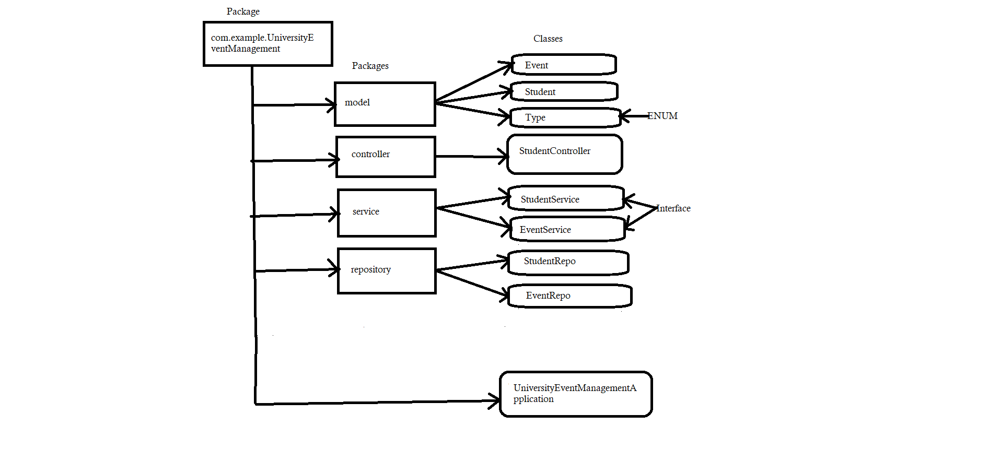

## Frameworks and language used 
* SpringBoot Framework and java language.
## Data Flow

## Data Structure used in your project
* Arraylist
## Project Summary

This is the "University Event Management System" Application which following the mvc-Architecture. I have created a package of UniversityEventManagement within this package I have created Four more packages to define layer as given in DFD. In this project a I have been created two model Student And Event which giving the whole information So here we are validating the data with the help of validations by performing crud operations on it with the help of endpoints like @GetMapping to get all the information of the particular model, @PostMapping to create a particular model using the attributes, @PuMapping to update the perticular model information using their Id, @deleteMapping to remove a particular model from list by giving specific Id.That's the whole project meant. 
